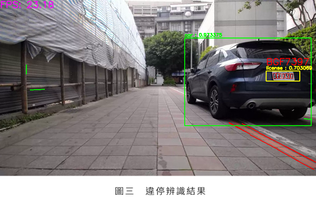

# YOLOv4_parking_enforcement_system

## 0. 介紹

    本專題為一套基於視覺辨識之移動式科技執法系統，此系統會偵測停放於路邊的車輛是否為違停車輛，並記錄違停車輛之車牌。



## 1. 使用方法

### 使用影片辨識

- 更改detect_withbox.py檔案中的影片路徑(video_dir)與儲存資料夾(save_folder)
- 設定開始幀數start_frame

### 使用即時辨識

- 將detect_withbox.py第17行開啟，並註解第18、19行程式

### 執行程式

```bash
python3 ~/src/detect_withbox.py
```

## 2. 參數調整

### 2-1. 霍夫直線偵測相關參數

minLineLength：偵測結果線段長度最小值

maxLineGap：同一線段中兩點的最大間距

```python
# line_detect.py line 15
lines = cv2.HoughLinesP(edges, 1, np.pi / 180, 60, minLineLength=20, maxLineGap=10)
```

### 2-2. 修改紅線斜率閥值

```python
# line_detect.py line 57
if ((slope <= -0.5)&(slope>=-1)) | ((slope >= 0.5)&(slope<=1)):
```

## 3.  原理說明

### 3-1 違停擷取

- 透過霍夫直線偵測與顏色篩選找出路邊違停紅線，如圖 (b)
- 使用車上搭載之攝影機，將影像傳至車上之電腦後，透過YOLOV4模型判斷路邊之車輛，並將辨識框範圍填滿，如圖(c)
- 並將兩者進行交集運算，如圖(d)，如有交集，則視為車輛有違停


### 3-2 車牌辨識

- 在判定車輛違停後便會執行車牌辨識，車牌辨識資料集使用Kaggle上之開源車牌資料集，內含433張已標註的影像，並以YOLOv4單類別訓練得到車牌辨識模型。


### 3-3 車號辨識

- 在抓去到違停車輛之車牌後，會透過影像處理方式，將車牌上之數字分割至5~7個數字(字母)影像，再透過訓練好之YOLOv4模型判斷個別數字(字母)之數值


### 3-4 違停辨識結果

- 最終將車輛邊界框範圍、車牌辨識框範圍、車牌號碼顯示於原圖片上。


